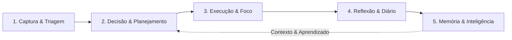
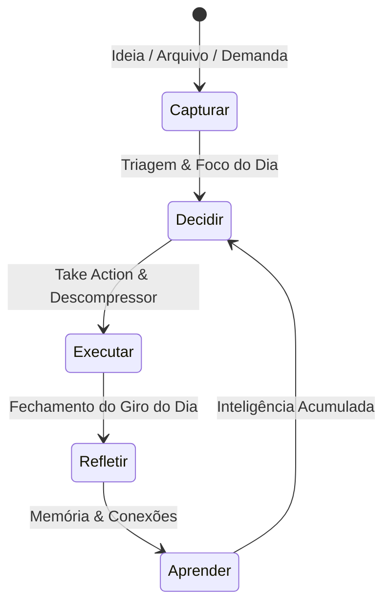
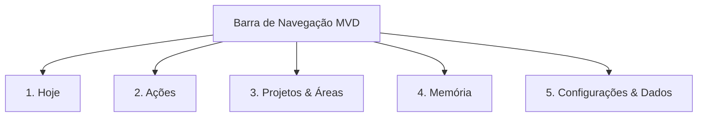

# Më Life OS — Blueprint de Estratégia de Produto & MVD

**Versão:** 1.0  
**Data:** 08 de Setembro de 2026  
**Status:** Etapas 3 e 4 Concluídas — Aguardando Validação do Usuário  
**Branch:** `gemini/mvd-product-blueprint`  
**Autor:** Antigravity AI (Pair Programming com Pedro Teixeira)  

---

## 1. Tese do Produto (Etapa 3)

### 1.1. As 12 Perguntas Fundamentais

1. **Para quem o Më existe inicialmente?**  
   *`[Confirmado pelo usuário]`*  
   O Më existe exclusivamente para **Pedro**, o próprio criador e operador. O sistema precisa resolver primeiro, com máxima fluidez e confiabilidade, a sua rotina real (estudos na Unicamp, saúde, cirurgia, finanças pessoais, projetos e rotinas de hábitos). Somente após funcionar perfeitamente para Pedro ele poderá ser compartilhado com pessoas de necessidades semelhantes.

2. **Qual problema central ele resolve?**  
   *`[Confirmado pelo usuário]`*  
   **Organizar informações não é suficiente.** Ferramentas tradicionais acumulam listas e notas, mas falham em transformar informação, intenção e aprendizado em **ação executada**. O Më resolve a paralisia entre o "saber o que deveria fazer" e o "efetivamente sentar e fazer".

3. **Qual transformação ele promete ao usuário?**  
   *`[Inferência fundamentada no contexto]`*  
   - **Antes:** Dispersão em dezenas de tabelas do Notion, tarefas esquecidas no meio de links, sensação de débito constante e recomeços frequentes sem acumular aprendizado.  
   - **Depois:** Clareza imediata ao abrir o computador, foco em 3 a 5 movimentos que realmente importam no dia, execução leve sem atrito e um histórico que devolve autoconhecimento e aprendizado real.

4. **Qual comportamento ele deseja estimular?**  
   *`[Recomendação]`*  
   - Execução diária consistente antes de reorganização estética de listas;  
   - Descompressão de tarefas intimidadoras em passos leves e viáveis (técnica do "Duro para o Mole" — 80/20);  
   - Fechamento consciente do dia com reflexão honesta sobre o que funcionou e o que precisa de ajuste.

5. **Por que Notion, calendário e gerenciadores de tarefas tradicionais não são suficientes?**  
   *`[Confirmado pelo usuário]`*  
   - **Notion:** Excelente repositório passivo, porém um péssimo motor de foco. Exige manutenção infinita e vira um "cemitério de boas intenções".  
   - **Calendário:** Registra apenas compromissos com horário marcado, ignorando o nível de energia mental (bateria), a urgência contextual e a descompressão de trabalho complexo.  
   - **Todoist / Reminders:** Listas lineares intermináveis que geram ansiedade em vez de discernimento estratégico, desconectadas da memória de longo prazo e dos aprendizados passados.

6. **Qual é o papel da Inteligência Artificial no Më?**  
   *`[Evidenciado no código e no PRD]`*  
   A IA atua como **assistente consultivo e descompressor cognitivo**. Ela sugere relações entre notas, resume arquivos locais, decompõe tarefas complexas e propõe ações estruturadas. **Regra inviolável:** A IA apenas propõe; nenhuma mutação de dados é gravada sem aprovação humana explícita (`approval_events`).

7. **Qual é o papel da Memória?**  
   *`[Evidenciado no código e no PRD]`*  
   A Memória não é um gráfico decorativo. Ela é a camada de **associação e contexto** que guarda o *porquê* das coisas: por que uma tarefa foi realizada, como ela se conecta a um projeto, qual recurso serviu de referência e que aprendizado foi gerado. Ela ilumina decisões futuras com base em evidências passadas.

8. **Qual é o papel dos dados?**  
   *`[Recomendação]`*  
   Os dados devem **retornar valor tangível ao operador**. Não se trata de ter dashboards coloridos com métricas de vaidade, mas sim de responder com clareza: *"Estou avançando nos meus projetos prioritários?", "Meus hábitos estão sustentando minha saúde?", "Quantas ações críticas concluí esta semana?"*.

9. **O que torna o Më verdadeiramente pessoal?**  
   *`[Confirmado pelo usuário]`*  
   O Më é calibrado para a psicologia, ritmo e vida real de Pedro: acolhe seu nível diário de bateria (Alta, Média, Recuperação), respeita suas áreas vitais (Saúde, Unicamp, Pessoal, Finanças), incorpora hábitos fisiológicos essenciais e opera de forma *local-first*, sem exposição de dados privados.

10. **O que torna o Më estratégico?**  
    *`[Inferência]`*  
    O Më conecta a visão de longo prazo (Áreas de responsabilidade e Projetos) com a micro-decisão de cada hora (Take Action e Radar do Dia). Nenhuma tarefa existe no vácuo; toda ação alimenta um projeto ou sustenta uma área da vida.

11. **O que torna o Më orientado à execução?**  
    *`[Confirmado pelo usuário]`*  
    Toda tela do fluxo principal conduz à pergunta: *"Qual é a próxima ação?"*. A interface remove o ruído secundário para que o usuário não perca tempo categorizando o que pode simplesmente executar ou descartar.

12. **O que fica explicitamente FORA do MVD?**  
    *`[Recomendação]`*  
    - Gráficos tridimensionais pesados (como o Three.js do Grafo 3D de Dados);  
    - Sincronização multiusuário em nuvem ou compartilhamento social;  
    - Automações em segundo plano sem confirmação do usuário;  
    - Integrações complexas com plataformas de terceiros antes de o fluxo local estar perfeito;  
    - Telas redundantes de inspeção crua de tabelas (`Dados Explorador Raw`).

---

### 1.2. Frase Central do Produto

Apresentamos três alternativas formuladas rigorosamente no padrão solicitado:

* **Opção 1 (Recomendada):**  
  > *“O Më ajuda Pedro a transformar intenções, notas e demandas dispersas em execução diária com foco e aprendizado cumulativo por meio de um ciclo integrado de decisão rápida, descompressão de tarefas e memória relacional.”*  
  *`[Recomendação]`* — **Justificativa:** É a que melhor equilibra o foco em execução, a descompressão prática de tarefas e a conexão com a memória viva.

* **Opção 2 (Operacional Direta):**  
  > *“O Më ajuda o criador a transformar sobrecarga de pendências em progresso visível e rotina sustentável por meio de triagem com IA local, radar diário de ações e reflexão sistemática.”*

* **Opção 3 (Estratégica / Segundo Cérebro):**  
  > *“O Më ajuda Pedro a transformar arquivos, metas e hábitos em decisões conscientes e tarefas concluídas por meio de um segundo cérebro local-first orientado à ação.”*

---

### 1.3. O Problema Central em Detalhe

* **A Situação Atual:** O usuário possui projetos exigentes em paralelo (Unicamp, saúde com cirurgia agendada, organização de apartamento, estudos avançados em IA/LLMOps e controle pessoal), com centenas de itens herdados de planilhas e páginas do Notion.
* **A Frustração:** Grande parte do tempo e da energia mental é consumida tentando manter sistemas de organização atualizados, gerando a sensação de trabalhar muito no "metatrabalho" sem ver as tarefas mais pesadas andarem.
* **A Consequência:** Procrastinação em tarefas intimidadoras, ansiedade diante de listas gigantescas e perda dos aprendizados valiosos que ocorrem durante a semana.
* **A Oportunidade:** Um sistema focado, sóbrio e silencioso que reduz o atrito de decisão a zero, corta a tarefa pesada em passos de 5 minutos e fecha o dia com sensação real de dever cumprido.

---

### 1.4. A Grande Transformação

| Dimensão | Antes do Më | Depois do Më |
| :--- | :--- | :--- |
| **Início do Dia** | Ansiedade diante de dezenas de tarefas dispersas no Notion. | Abertura do **Hoje / Giro do Dia**: foco em 3 a 5 movimentos claros e nível de bateria alinhado. |
| **Tarefas Difíceis** | Adiar por parecerem complexas ou demoradas demais. | **Descompressor 80/20**: transformar o "duro" em uma ação leve de 5 minutos e executar. |
| **Notas & Arquivos** | Acúmulo passivo em pastas e abas esquecidas. | **Captura rápida e Knowledge Intake**: triagem com IA local e vinculação a nós relevantes. |
| **Final do Dia** | Sensação difusa de cansaço sem saber se o dia rendeu. | **Journal & Retrospectiva**: registro rápido do que funcionou, vitórias do dia e aprendizado guardado. |
| **Histórico** | Arquivo morto de páginas antigas. | **Memória Relacional**: conexões vivas que alimentam decisões futuras com sabedoria acumulada. |

---

### 1.5. Os 6 Princípios Norteadores

1. **Ação antes de acumulação:** Uma tarefa feita vale mais do que dez páginas perfeitamente categorizadas.
2. **Clareza antes de complexidade:** A interface deve respirar; alta densidade de informação com hierarquia nítida, sem poluição visual ou recursos desnecessários.
3. **Memória a serviço da decisão:** Não guardamos conhecimento para montar um museu, mas para orientar o próximo passo estratégico.
4. **IA propõe, humano decide:** A inteligência artificial trabalha como analista diligente — ela descompacta, analisa e sugere, mas o usuário mantém a soberania de aprovar ou rejeitar toda alteração.
5. **Progresso precisa ser visível:** O avanço real em projetos e hábitos deve ser sentido imediatamente na interface, gerando reforço positivo e satisfação contínua.
6. **Dados devem devolver valor prático:** Se um dado é registrado, ele deve retornar como clareza, insight ou alívio de carga mental, nunca como burocracia de preenchimento.

---

### 1.6. A Antítese: O que o Më NÃO é e NÃO deve se tornar

* **Não é outro Notion:** Não haverá liberdade irrestrita para criar bancos de dados infinitos e passar horas customizando layouts estéticos. O fluxo é opinativo e direcionado à ação.
* **Não é um chat passivo de IA:** Não é uma caixa de diálogo para bater papo genérico. A IA no Më existe para destravar tarefas do mundo real, sugerir links entre nós e resumir conteúdo acionável.
* **Não é um painel corporativo de vaidade:** Gráficos 3D pesados, métricas infladas de BI sem contexto pessoal e relatórios prolixos são terminantemente rejeitados.
* **Não é uma lista estressante de afazeres:** Não exibiremos uma coluna infinita de 100 tarefas vermelhas. O sistema prioriza e oculta o que não pertence ao dia de hoje.

---

## 2. Os 5 Pilares do Produto (Capacidades)

### Pilar 1: Captura & Triagem
* **Objetivo:** Esvaziar a mente imediatamente e acolher arquivos/notas sem exigir categorização no ato da inspiração.
* **Entrada:** Frases soltas, links, notas rápidas, documentos PDF/DOCX/TXT ou pastas ZIP.
* **Transformação:** Despejo mental rápido em área de entrada temporária (Inbox), higienização técnica e proposta de categorização via IA.
* **Saída:** Itens limpos aguardando alocação consciente ou envio direto para a fila do dia.
* **Telas Relacionadas:** Quick Capture (`S02`), Arquivos Pendentes / Inbox (`S13`), Para-Organizer Upload (`S23`).
* **Valor para o Usuário:** Fim do medo de perder ideias; mente livre para pensar e não para guardar.
* **Métrica de Sucesso:** Tempo de captura inferior a 5 segundos; Inbox zerada ao menos uma vez por semana.
* **Relação com Execução:** Protege o usuário de interrupções durante o trabalho focado.
* **Prioridade no MVD:** **Essencial** `[Confirmado pelo usuário]`.

---

### Pilar 2: Decisão & Planejamento
* **Objetivo:** Definir com sobriedade onde a energia finita do dia e da semana deve ser investida.
* **Entrada:** Projetos ativos, prazos reais, nível de bateria mental e demandas prioritárias.
* **Transformação:** Seleção das 3 a 5 tarefas inegociáveis do dia, alocação em blocos temporais da semana e descompressão de tarefas duras em ações leves.
* **Saída:** Um plano diário claro e um mapa semanal equilibrado, sem sobrecarga fantasiosa.
* **Telas Relacionadas:** Visão Geral (`S01`), Weeks / Planejador Semanal (`S04`), Projects Grid (`S06`), Project Detail (`S07`).
* **Valor para o Usuário:** Eliminação da fadiga de decisão no meio da jornada.
* **Métrica de Sucesso:** 100% dos dias iniciados com o "Foco do Dia" estabelecido em menos de 3 minutos.
* **Relação com Execução:** Estabelece a ponte direta entre o estratégico (Projetos) e o tático (Tarefas).
* **Prioridade no MVD:** **Essencial** `[Confirmado pelo usuário]`.

---

### Pilar 3: Execução & Foco
* **Objetivo:** Garantir que o usuário realize a tarefa atual sem distrações, sentindo a tração do progresso.
* **Entrada:** A tarefa selecionada no momento, contexto do projeto e recursos de apoio.
* **Transformação:** Isolamento da ação, controle de hábitos e registro do término com ganho de progresso.
* **Saída:** Tarefa concluída, progresso percentual do projeto atualizado e hábitos marcados.
* **Telas Relacionadas:** Take Action (`S03`), Tasks Kanban/Tabela (`S08`), Hábitos Tracker (`S14`).
* **Valor para o Usuário:** Satisfação instantânea de riscar o item da lista e ver o projeto avançar.
* **Métrica de Sucesso:** Taxa de conclusão diária das tarefas prioritárias superior a 75%.
* **Relação com Execução:** É o próprio ato executivo; o ápice de todo o sistema.
* **Prioridade no MVD:** **Essencial** `[Confirmado pelo usuário]`.

---

### Pilar 4: Reflexão & Diário
* **Objetivo:** Fechar o ciclo diário com honestidade intelectual, destilando aprendizado e celebrando vitórias reais.
* **Entrada:** O que aconteceu durante o dia, tarefas concluídas, obstáculos encontrados e impressões pessoais.
* **Transformação:** Registro do Giro do Dia, balanço de energia, avaliação do que funcionou e ajuste de rota para o dia seguinte.
* **Saída:** Um registro histórico estruturado (Log Diário) e notas reflexivas salvas no segundo cérebro.
* **Telas Relacionadas:** Journal / Giro do Dia (`S05`), Dados / Registros (`S17`).
* **Valor para o Usuário:** Autoconhecimento, alívio de estresse e melhora contínua de produtividade.
* **Métrica de Sucesso:** Consistência de fechamento diário (ao menos 5 reflexões registradas por semana).
* **Relação com Execução:** Retroalimenta a capacidade executiva futura, evitando que os mesmos erros se repitam.
* **Prioridade no MVD:** **Essencial** `[Confirmado pelo usuário]`.

---

### Pilar 5: Memória & Inteligência
* **Objetivo:** Conectar pessoas, tarefas, projetos, referências e aprendizados em uma teia relacional consultável.
* **Entrada:** Arquivos twin, nós criados, anotações de estudo, recursos externos e dúvidas do operador.
* **Transformação:** Indexação em nós tipados, grafo relacional D3 force-directed e respostas fundamentadas da IA com cartões de aprovação.
* **Saída:** Grafo visual interativo (estilo Obsidian), busca instantânea e propostas acionáveis do Jarvis.
* **Telas Relacionadas:** Memória Mapa (`S24`), Memória Nós (`S25`), Memória Relações (`S26`), Jarvis Chat (`S28`), Biblioteca de Recursos (`S11`).
* **Valor para o Usuário:** Confiança de que nenhuma experiência valiosa será esquecida no tempo.
* **Métrica de Sucesso:** Recuperação de qualquer contexto ou projeto histórico em menos de 10 segundos.
* **Relação com Execução:** Fornece o contexto e as referências exatas necessárias para realizar tarefas difíceis.
* **Prioridade no MVD:** **Importante / Essencial na consulta** `[Confirmado pelo usuário]`.

---

## 3. O Loop Central do Produto

### 3.1. Comparação entre as Duas Opções

* **Opção A — Loop Essencial (4 Etapas):**  
  `Decidir → Executar → Refletir → Aprender`  
  *Análise:* Excelente para a disciplina diária de quem já está sentado com suas tarefas organizadas, mas ignora a realidade do caos diário: a chegada constante de novas demandas, mensagens e arquivos.

* **Opção B — Loop Ampliado com Captura (5 Etapas — Recomendada):**  
  `Capturar → Decidir → Executar → Refletir → Aprender`  
  *`[Recomendação]`*  
  *Justificativa:* O Më é um sistema de vida (Life OS). A captura não pode ser omitida porque, se o usuário não tiver onde descarregar uma demanda rápida no calor do momento, ele recorrerá ao WhatsApp, papel ou bloco de notas, quebrando a integridade do sistema.

---

### 3.2. Anatomia Detalhada de Cada Etapa do Loop (Opção B)

#### Etapa 1: Capturar
* **Gatilho:** Uma ideia surge na cabeça, uma mensagem do WhatsApp chega, um arquivo é recebido ou um médico entrega uma receita.
* **Pergunta do Usuário:** *"Como descarrego isso agora para não esquecer e não perder meu foco atual?"*
* **Ação:** Digitar uma frase no Quick Capture ou soltar um arquivo no Inbox.
* **Tela Principal:** `Quick Capture` ou `Inbox / Arquivos Pendentes`.
* **Dado de Entrada:** Texto livre, arquivo local ou link.
* **Resultado:** Item registrado com status `not-started` na área de triagem temporária.
* **Próximo Passo:** Voltar imediatamente à execução ou agendar para a triagem do dia.
* **Falha Possível:** O usuário parar para preencher 10 campos e se distrair da sua tarefa atual.
* **Recuperação:** Campo único de digitação rápida, sem obrigatoriedade de metadados no ato da captura.
* **Evidência de Progresso:** Contador de Inbox incrementado sem travamento da interface.

#### Etapa 2: Decidir
* **Gatilho:** Início da manhã ou conclusão de um bloco de tarefas.
* **Pergunta do Usuário:** *"Qual é a coisa mais importante que preciso fazer hoje, considerando minha energia real?"*
* **Ação:** Verificar o nível de bateria, revisar o radar do dia e escolher as 3 a 5 prioridades inegociáveis.
* **Tela Principal:** `Hoje / Visão Geral` e `Journal (Giro do Dia)`.
* **Dado de Entrada:** Nível de bateria (Alta/Média/Recup), lista de pendências e projetos ativos.
* **Resultado:** Lista prioritária do dia definida; tarefas intimidadoras quebradas em ações leves no Descompressor.
* **Próximo Passo:** Ir para a tela de ação e focar no primeiro item.
* **Falha Possível:** Escolher 20 tarefas e se sobrecarregar antes mesmo de começar.
* **Recuperação:** A interface sinaliza visualmente quando mais de 5 prioridades são definidas para o mesmo dia.
* **Evidência de Progresso:** Ticker do dia atualizado com o número de tarefas no radar.

#### Etapa 3: Executar
* **Gatilho:** Momento de trabalho focado (time-blocking).
* **Pergunta do Usuário:** *"O que exatamente preciso fazer nos próximos 25 minutos?"*
* **Ação:** Abrir a tarefa prioritária no topo da fila, usar os links/recursos anexados e marcar como concluída ao terminar.
* **Tela Principal:** `Take Action` ou `Project Detail`.
* **Dado de Entrada:** Tarefa ativa com deadline, prioridade e projeto associado.
* **Resultado:** Tarefa alterada para `status: done`, hábitos do dia tickados e progresso do projeto atualizado.
* **Próximo Passo:** Fazer uma pausa breve e pegar a próxima ação prioritária.
* **Falha Possível:** Procrastinação por bloqueio cognitivo ("o trabalho parece difícil demais").
* **Recuperação:** Acionar o assistente Jarvis ou usar o Descompressor para transformar a tarefa em um passo de 2 minutos.
* **Evidência de Progresso:** Barra de progresso do projeto avança visualmente em tempo real.

#### Etapa 4: Refletir
* **Gatilho:** Fim do expediente ou encerramento da noite.
* **Pergunta do Usuário:** *"O que realmente avançou hoje? O que travou e por quê?"*
* **Ação:** Abrir o Journal, registrar as vitórias do dia, anotar aprendizados e apontar melhorias para amanhã.
* **Tela Principal:** `Journal / Giro do Dia`.
* **Dado de Entrada:** Reflexão livre em texto e avaliação de energia e foco.
* **Resultado:** Registro salvo no diário histórico com data, métricas de conclusão e notas pessoais.
* **Próximo Passo:** Fechar o computador com a mente limpa e sensação de paz de espírito.
* **Falha Possível:** Pular a reflexão por preguiça ou cansaço excessivo.
* **Recuperação:** Formulário com perguntas de gatilho rápidas (1 frase basta para o registro ter valor).
* **Evidência de Progresso:** Registro arquivado na linha do tempo do Log Diário.

#### Etapa 5: Aprender
* **Gatilho:** Necessidade de tomar uma decisão semelhante ou início do planejamento semanal.
* **Pergunta do Usuário:** *"O que eu já descobri ou documentei sobre isso no passado?"*
* **Ação:** Pesquisar no Grafo da Memória ou perguntar diretamente ao Jarvis.
* **Tela Principal:** `Memória (Mapa / Nós)` e `Jarvis`.
* **Dado de Entrada:** Termo de busca, nó relacionado ou pergunta consultiva.
* **Resultado:** Contexto completo recuperado: conexões entre projetos, referências associadas e notas anteriores.
* **Próximo Passo:** Alimentar a etapa de Decisão com essa bagagem assimilada.
* **Falha Possível:** A memória ser opaca e o usuário não conseguir achar o que precisa.
* **Recuperação:** Busca instantânea por texto completo, filtros por tipo (Projeto, Área, Recurso, Tarefa) e visualização de vizinhança no grafo.
* **Evidência de Progresso:** Nós navegáveis exibindo conexões vivas e históricas.

---

## 4. Mapeamento das Jornadas do Usuário

| # | Jornada | Frequência | Prioridade MVD | Telas Principais | Resultado Esperado |
|---|---|:---:|:---:|---|---|
| **J1** | **Começar o Dia com Clareza** | Diária (Manhã) | **Crítica** | `Hoje` / `Journal` | Nível de energia definido, 3 a 5 prioridades travadas no radar. |
| **J2** | **Executar a Próxima Ação** | Diária (Contínua) | **Crítica** | `Take Action` / `Project Detail` | Foco total na ação corrente sem distração lateral; conclusão registrada. |
| **J3** | **Descomprimir Tarefa Pesada** | Sob Demanda | **Crítica** | `Journal (Descompressor)` | A tarefa intimidadora é transformada em um passo leve de 5 min e entra no radar. |
| **J4** | **Captura Imediata sem Atrito** | Sob Demanda | **Importante** | `Quick Capture` / `Inbox` | Ideia ou demanda anotada em segundos; foco de trabalho preservado. |
| **J5** | **Encerrar o Dia & Retroalimentar** | Diária (Noite) | **Crítica** | `Journal` | Registro sincero do que funcionou, hábitos salvos e mente aliviada para dormir. |
| **J6** | **Revisão & Planejamento Semanal** | Semanal (Domingo/Segunda) | **Importante** | `Weeks` / `Projects` | Alinhamento macro dos projetos e agenda de blocos de execução da semana. |
| **J7** | **Consultar Contexto & Memória** | Conforme Necessário | **Importante** | `Memória` / `Jarvis` | Recuperação instantânea de arquivos, nós relacionados e decisões passadas. |
| **J8** | **Ingerir e Organizar Lotes de Arquivos**| Ocasional | **Futura** | `Para-Organizer (Upload)` | Processamento de ZIP/pastas pesadas com propostas revisadas via IA local. |

---

## 5. Auditoria de Sobreposições e Redundâncias

A auditoria visual nas 28 telas revelou 10 áreas de sobreposição evidente no produto atual:

1. **Visão Geral (`S01`) e Take Action (`S03`):**  
   - *Duplicidade:* Ambas exibem listas de tarefas pendentes e filtros de prioridade.  
   - *Diagnóstico:* Visão Geral tenta ser um dashboard panorâmico e Take Action é a lista vertical de foco.  
   - *Recomendação:* **UNIR elementos essenciais**. A tela inicial deve ser uma composição focada onde o "Radar do Dia" já funciona como o gatilho de execução imediata.

2. **Quick Capture (`S02`) e Inbox / Arquivos Pendentes (`S13`):**  
   - *Duplicidade:* Quick Capture joga tarefas para a área "Inbox", e a tela Inbox exibe essas mesmas tarefas com o botão "Organizar".  
   - *Diagnóstico:* São dois pedaços desconectados da mesma jornada (captura e triagem).  
   - *Recomendação:* **UNIR no fluxo de entrada**. O Quick Capture deve ser um modal/gaveta acessível de qualquer ponto e alimentar uma visualização de triagem limpa.

3. **Projects Grid (`S06`) e Tasks (`S08`):**  
   - *Duplicidade:* A tela de Tasks permite agrupar por projeto e a tela de Projetos lista o progresso e as tarefas de cada projeto.  
   - *Diagnóstico:* Faz parte do modelo PARA, mas a visualização de tarefas isoladas vira um repositório infinito sem contexto.  
   - *Recomendação:* **MANTER separadas**, mas garantir que as tarefas sempre herdem o contexto de seu Projeto-pai.

4. **Journal (`S05`) e Dados / Registros (`S17`):**  
   - *Duplicidade flagrante:* `Dados / Registros` é uma tabela rígida com data, o que funcionou e o que melhorar; o `Journal` é a página bonita de reflexão com exatamente essas mesmas perguntas.  
   - *Diagnóstico:* A tela de registros em Dados é apenas uma visão crua redundante do Journal.  
   - *Recomendação:* **UNIR**. O histórico do Journal deve suprir a necessidade de consultar reflexões anteriores, eliminando a tabela de Registros em Dados.

5. **Dados (`S15..S20`) e Para-Organizer (`S21..S23`):**  
   - *Duplicidade:* Ambos lidam com o Knowledge Intake (KI). Dados tem a tabela "Córtex" e Para-Organizer tem a visão de "Upload" e propostas.  
   - *Diagnóstico:* Confusão conceitual entre o motor de dados e a ferramenta que alimenta o motor.  
   - *Recomendação:* O Para-Organizer deve ser o pipeline de ingestão dentro da área de Dados/Sistema, eliminando a fragmentação em menus separados.

6. **Dados / Grafo 3D (`S20`) e Memória / Mapa D3 (`S24`):**  
   - *Duplicidade crítica:* Ambos representam o grafo relacional dos mesmos dados do KI. O grafo 3D usa Three.js / WebGL e é instável/pesado; o Mapa da Memória usa D3 force-directed 2D com visual Obsidian limpo na paleta Forest/Nude.  
   - *Diagnóstico:* Redundância técnica que infla o bundle e confunde o usuário.  
   - *Recomendação:* **ARQUIVAR o Grafo 3D (`S20`)**. Consolidar toda a visualização espacial exclusivamente no Mapa D3 da Memória (`S24`).

7. **Memória (`S24..S27`) e Jarvis (`S28`):**  
   - *Relação correta:* Não é sobreposição, mas sim complementaridade. O Jarvis consulta a Memória para responder e sugere novas relações que aguardam aprovação no painel de Relações (`S26`).

8. **Áreas (`S09`) e Projetos (`S06`):**  
   - *Diagnóstico:* Hierarquia clássica do PARA. Áreas são responsabilidades contínuas sem prazo (Saúde, Unicamp, Finanças); Projetos são iniciativas com prazo e meta definida (Cirurgia, Óculos, LE704).  
   - *Recomendação:* **MANTER**, garantindo navegação natural entre Área → Projetos da Área.

9. **Recursos (`S11`) e Knowledge Intake Córtex (`S15`):**  
   - *Diagnóstico:* Recursos são entidades do tipo `resource` dentro do KI. Exibi-los em uma biblioteca visual é útil; exibi-los numa tabela crua de banco é apenas depuração.  
   - *Recomendação:* Manter a biblioteca visual de Recursos e restringir o Córtex para fins de diagnóstico.

10. **Canvas (`canvas`) e o Produto Operacional:**  
    - *Diagnóstico:* O Canvas de Telas é o ambiente de observabilidade, design system e conferência visual da engenharia/design; o produto operacional é a ferramenta viva de Pedro.  
    - *Recomendação:* Manter o Canvas acessível pelo menu lateral com nome canônico, mas com finalidade clara de metadesenvolvimento.

---

## 6. Arquitetura de Informação & Navegação

### 6.1. Navegação Atual (Auditada no Código)

A barra lateral atual possui **16 links operacionais divididos em 4 seções**:

* **Início:** Visão Geral (`home`), Canvas (`canvas`), Memória (`memoria`), Quick Capture (`quick-capture`).
* **Agenda:** Take Action (`take-action`), Weeks (`weeks`), Journal (`journal`).
* **PARA:** Projects (`projects`), Tasks (`tasks`), Areas (`areas`), Recursos (`recursos`), Arquivados (`arquivados`).
* **Sistema:** Arquivos Pendentes (`inbox`), Hábitos (`habitos`), Dados (`dados`), Para-Organizer (`para-organizer`).

**Problemas identificados:**
1. **Excesso cognitivo:** 16 destinos principais dispersam a atenção do operador.
2. **Distância até a ação:** O usuário precisa clicar em diferentes menus para ver o que tem para fazer, registrar um hábito e escrever seu diário.
3. **Duplicação de conceitos:** "Quick Capture" e "Arquivos Pendentes" estão em grupos opostos; "Journal" e "Dados/Registros" guardam a mesma coisa; "Dados/Grafo 3D" e "Memória/Mapa" mostram o mesmo grafo.

---

### 6.2. Navegação Proposta para o MVD (5 Destinos Centrais)

*`[Recomendação]`*

Para o MVD, propomos uma navegação simplificada e focada em **5 grandes destinos** na barra lateral:

1. **`Hoje` (Comando Diário):**  
   *Fusão refinada entre Visão Geral e Giro do Dia (Journal).*  
   Reúne num só lugar: nível de bateria, as 3 a 5 prioridades inegociáveis, o radar rápido de hábitos do dia, o Descompressor 80/20 e a reflexão da noite.
2. **`Ações` (Central Executiva):**  
   *Visão operacional de tarefas.*  
   Permite alternar entre os modos: **Foco Imediato (Take Action)**, **Kanban por Status** e **Agenda Semanal (Weeks)**.
3. **`Projetos & Áreas` (Estrutura Estratégica PARA):**  
   *Mapa das iniciativas de curto, médio e longo prazo.*  
   Visão integrada de Projetos com progresso real, Áreas de responsabilidade e Arquivados.
4. **`Memória` (Segundo Cérebro Relacional):**  
   *O repositório vivo de conhecimento.*  
   Mapa relacional D3 Obsidian-like, Nós, Relações com governança de aprovação e Biblioteca de Recursos.
5. **`Sistema & Dados` (Motor Local & Ferramental):**  
   *Configurações, chaves e importação.*  
   Credenciais seguras da Gemini API, pipeline do Para-Organizer para upload de arquivos/ZIP e logs operacionais.

*(Nota: O item **Canvas** permanece preservado no rodapé da navegação ou atalho técnico para inspeção visual do Design System e testes).*

---

### 6.3. Análise da Tela Inicial e Recomendação

* **Candidata 1: Visão Geral Atual (`S01`):**  
  *Prós:* Mostra KPIs bonitos (taxa de conclusão, áreas, projetos ativos).  
  *Contras:* É passiva. Parece um dashboard corporativo onde o usuário "olha números" em vez de agir.
* **Candidata 2: Take Action (`S03`):**  
  *Prós:* É 100% orientada à ação. Lista as tarefas imediatas.  
  *Contras:* Falta contexto diário — não considera o nível de bateria mental, não exibe hábitos do dia e não estimula a reflexão.
* **Candidata 3 (Recomendada): Composição "Hoje / Giro do Dia":**  
  *`[Recomendação]`*  
  Uma tela que abre com o **Giro do Dia**:  
  - Cabeçalho limpo com a data e seleção da Bateria Mental (Alta, Média, Recuperação);  
  - Ticker de foco com os 3 a 5 movimentos cruciais do dia;  
  - O **Descompressor 80/20** integrado para destravar tarefas que parecem intimidadoras;  
  - Radar de hábitos essenciais (mobilidade, treino, dieta, leitura);  
  - Espaço de reflexão para fechar o dia com chave de ouro.  
  *Justificativa:* É a única composição que resolve o problema central do Më: transformar intenção em ação real, com respeito ao estado fisiológico e mental de Pedro.

---

## 7. Mapeamento de Dados e Conteúdo Atual

### 7.1. Classificação dos Conjuntos de Dados Encontrados

Após auditoria minuciosa em `src/store.tsx`, `tasks.csv` e no IndexedDB, classificamos os dados em 5 categorias:

| Conjunto | Origem Auditada | Classificação | Observação de Conteúdo |
|---|---|:---:|---|
| **Tarefas (`initialTasks`)** | `tasks.csv` via Notion export | **Real Histórico** | Tarefas pessoais reais de Pedro (maio/junho de 2026), envolvendo Unicamp (Lab 1 - LE704, Eng. Econômica - ER704), cirurgia e saúde. |
| **Projetos (`initialProjects`)** | `src/store.tsx` | **Real Histórico** | 11 projetos reais (Óculos, 2° Cérebro, LE704, Cirurgia, Dindoca, Apartamento, ApartaRank, Nutricionista, Academia, LLMOps). |
| **Áreas (`initialAreas`)** | `src/store.tsx` | **Real Histórico** | 6 áreas da vida real de Pedro (Unicamp: 56 itens, Estudo: 17, Saúde: 26, Pessoal: 21, Profissional: 5, Finanças: 12). |
| **Hábitos (`initialHabits`)** | `src/store.tsx` | **Real Atual / Pessoal** | 5 hábitos essenciais da rotina real de Pedro: Fisioterapia/Mobilidade, Revisão Lab1, Treino, Dieta e Leitura. |
| **Recursos (`initialResources`)**| `src/store.tsx` | **Real Histórico** | 8 itens reais (NuBank, Óticas Ipanema, Plano Alimentar Pedro Teixeira, Referências de Design). |
| **Logs Diários (`mockDailyLogs`)**| `src/components/views/DadosView.tsx` | **Fixture Histórica** | 5 registros simulando reflexões de 08 a 12 de maio de 2026. |
| **Propostas & Nós KI** | IndexedDB / Fixtures | **Fixture de Teste** | Nós do Single Source of Truth gerados nos testes E2E do pipeline de ingestão. |

---

### 7.2. Proposta de Clean Demo Dataset para a Futura Etapa Visual

*`[Recomendação]`*

Para as futuras etapas visuais e de design refinado (inspiradas na sobriedade de BCG e Goldman Sachs), propomos uma semente de dados limpa, consistente e coesa que represente um ciclo executivo exemplar:

1. **Uma Decisão Estratégica:**  
   - *"Priorizar recuperação física e conclusão da disciplina crítica LE704 antes de iniciar novas iniciativas profissionais."*
2. **Uma Ação Prioritária Descomprimida:**  
   - Tarefa Dura: *"Escrever relatório técnico A3 de Filtração"*.  
   - Ação Descomprimida (80/20): *"Abrir a planilha de dados e plotar o gráfico de volume versus tempo (15 min)"*.
3. **Um Projeto com Progresso Tangível:**  
   - Projeto: `LE704 - Laboratório de Engenharia 1` (Área: Unicamp | 24/39 tarefas | 62% concluído | Status: Ativo).
4. **Uma Reflexão Diária Honesta:**  
   - *"O time-blocking matinal foi excelente para fechar a pendência médica. À tarde a energia caiu; amanhã vou usar o Descompressor logo após o almoço."*
5. **Um Aprendizado Destilado:**  
   - *"Quebrar entregas de engenharia em passos menores reduz a procrastinação de dias para menos de 30 minutos."*
6. **Uma Relação de Memória Conectada:**  
   - Nó Origem: `Relatório A3 Filtração` → Relação: `depends_on` → Nó Destino: `Planilha de Dados Experimentais`.
7. **Uma Métrica de Execução Significativa:**  
   - 4 de 5 tarefas do foco concluídas (80% de tração real no dia); hábito de Fisioterapia mantido por 13 dias seguidos.

---

## 8. Escopo do MVD (Minimum Viable Delightful)

### 8.1. Estratégia de Escopo

* **ESSENCIAL:** O núcleo irredutível. Sem isso, o Më não entrega sua transformação de transformar intenção em ação.
* **IMPORTANTE:** Amplia a experiência e aprofunda o segundo cérebro, entrando logo após a estabilização do núcleo.
* **FUTURO:** Recursos avançados que não devem bloquear o lançamento da versão pessoal utilizável.

---

### 8.2. Divisão Detalhada de Funcionalidades

#### A. ESSENCIAL
1. **Comando Diário (Hoje / Giro do Dia):** Header de data, seleção de bateria, foco em 3 a 5 tarefas e tracker de hábitos.
2. **Execução Focada (Take Action):** Fila limpa das tarefas prioritárias ordenadas por urgência, com conclusão instantânea.
3. **Descompressor 80/20:** Mecanismo de decomposição de tarefa intimidadora em ação leve de 5 minutos.
4. **Gestão Estrutural PARA:** Visualização limpa de Projetos (com progresso) e Áreas de responsabilidade.
5. **Journal & Fechamento:** Campo de reflexão noturna que salva o histórico do dia de forma persistente.
6. **Armazenamento Local Seguro:** Persistência em IndexedDB no navegador do usuário, com funcionamento 100% offline.

#### B. IMPORTANTE
1. **Planejador Semanal (Weeks):** Visão das tarefas alocadas pelos 7 dias da semana para balanceamento de carga.
2. **Quick Capture Global:** Atalho rápido para capturar notas e tarefas de qualquer lugar sem interromper a tela ativa.
3. **Memória Relacional D3 (Grafo 2D):** Visualização em nós e conexões Obsidian-like dos projetos e aprendizados.
4. **Assistente Jarvis com Cartões de Aprovação:** IA conversacional conectada ao Gemini que só executa após o usuário clicar em "Aprovar".
5. **Configurações de Credenciais Locais:** Gestão segura da Gemini API Key salva no `localStorage` do dispositivo.

#### C. FUTURO
1. **Pipeline de Ingestão de Lotes Pesados (Para-Organizer ZIP/OCR):** Processamento em lote de documentos complexos e livros digitalizados.
2. **Analytics & BI Avançado:** Relatórios históricos de produtividade acumulada ao longo de meses.
3. **Sincronização Multi-dispositivo / Nuvem Criptografada.**
4. **Aplicativo Mobile Nativo (PWA instalável / iOS wrapper).**

---

### 8.3. Critérios Observáveis de Aceite (DADO → QUANDO → ENTÃO)

#### Critério 1: Decisão Rápida do Foco Diário
* **DADO** que Pedro abre o Më no início da manhã com dezenas de pendências acumuladas,
* **QUANDO** ele acessa a tela inicial Hoje, seleciona seu nível de bateria e marca as prioridades,
* **ENTÃO** o sistema isola no radar exatamente as 3 a 5 ações cruciais, ocultando o ruído secundário em menos de 2 minutos.

#### Critério 2: Descompressão Cognitiva de Tarefas Difíceis
* **DADO** que o usuário possui uma tarefa complexa que está travando sua rotina (ex: "Relatório de Engenharia"),
* **QUANDO** ele insere o item no Descompressor 80/20 e define um primeiro passo de 5 minutos,
* **ENTÃO** o sistema cria imediatamente uma ação leve no radar diário, reduzindo o atrito mental de início a zero.

#### Critério 3: Registro Fiel e Satisfatório de Execução
* **DADO** que uma tarefa prioritária foi finalizada no mundo real,
* **QUANDO** o usuário clica no botão de conclusão na lista de ação,
* **ENTÃO** a tarefa muda de estado visualmente, a barra de progresso do projeto associado avança imediatamente e a conquista é contabilizada para o fechamento do dia.

#### Critério 4: Fechamento Reflexivo e Esvaziamento Mental
* **DADO** que o usuário chegou ao final do seu dia de trabalho,
* **QUANDO** ele abre o Journal, responde em poucas frases o que funcionou e clica em salvar,
* **ENTÃO** o registro diário é gravado no histórico persistente e a mente do operador fica livre de pendências para o descanso.

#### Critério 5: Soberania Humana com a IA
* **DADO** que o usuário solicita ajuda ao Jarvis para estruturar um novo plano de estudos,
* **QUANDO** a IA processa o pedido via Gemini API,
* **ENTÃO** ela gera um cartão de proposta interativo com botões explícitos de "Aprovar" e "Rejeitar", sem gravar nada no banco antes do clique de confirmação.

---

## 9. Matriz de Riscos, Hipóteses e Decisões Pendentes

### 9.1. Riscos Identificados

| Risco | Impacto | Mitigação Proposta |
|---|:---:|---|
| **Sobrecarga de escopo (Feature Creep)** | Alto | Manter o MVD estritamente focado no ciclo diário (Decidir → Executar → Refletir), adiando ferramentas secundárias. |
| **Dependência de dados antigos do Notion** | Médio | Usar os dados do Notion como histórico/validação, mas preparar o Clean Demo Dataset para o desenho visual limpo. |
| **Peso do bundle por bibliotecas redundantes** | Médio | Manter a divisão de chunks implementada no Vite e arquivar dependências pesadas de Three.js / Grafo 3D. |
| **Perda de dados em limpeza de cache do browser** | Médio | Implementar rotina de backup/exportação JSON em um clique para download local. |

---

### 9.2. Hipóteses do Produto

1. *`[Hipótese 1]`* Ao limitar as escolhas diárias a no máximo 5 tarefas alinhadas à bateria mental, a taxa de conclusão semanal de Pedro aumentará significativamente.
2. *`[Hipótese 2]`* A técnica do Descompressor 80/20 integrada à tela inicial eliminará o bloqueio inicial em relatórios e entregas da Unicamp.
3. *`[Hipótese 3]`* A sobriedade visual inspirada em BCG e Goldman Sachs manterá o foco na densidade de dados e na seriedade executiva, evitando o cansaço visual comum em ferramentas cheias de gradientes e efeitos de IA.

---

### 9.3. Decisões que Exigem Validação do Usuário

1. **Unificação da Tela Inicial (`Hoje`):**  
   *`[Recomendação pendente de validação]`*  
   Aprovação formal para fundir os conceitos de Visão Geral (`S01`) e Journal (`S05`) em uma tela única de comando diário ("Hoje"), evitando a duplicidade de radares.

2. **Arquivamento do Grafo 3D (`S20`):**  
   *`[Recomendação pendente de validação]`*  
   Aprovação para desativar a aba do Grafo 3D em `Dados` e concentrar toda a visualização espacial no Mapa 2D D3 da Memória (`S24`), reduzindo complexidade e peso de dependências.

3. **Arquivamento do Explorador Raw de Dados (`S18`):**  
   *`[Recomendação pendente de validação]`*  
   Aprovação para remover a tabela crua de inspeção de banco da navegação do usuário comum, mantendo-a apenas como ferramenta de teste para desenvolvedores.

4. **Transição de Quick Capture para Modal/Gaveta Global:**  
   *`[Recomendação pendente de validação]`*  
   Aprovação para transformar a captura rápida de uma página isolada em um gatilho rápido acessível por atalho de teclado em qualquer tela do sistema.

5. **Adoção do Loop Ampliado de 5 Etapas no MVD:**  
   *`[Recomendação pendente de validação]`*  
   Confirmação de que o ciclo `Capturar → Decidir → Executar → Refletir → Aprender` será o padrão arquitetural do Më Life OS.
